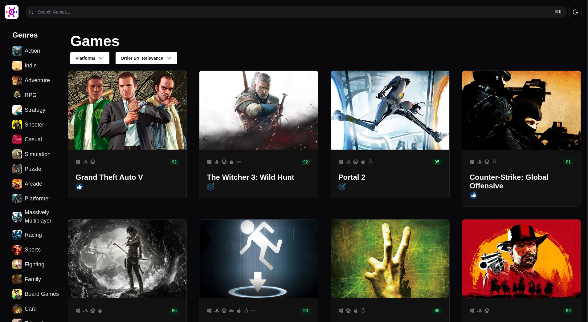

# Game Hub

A game discovery application built with React 19, TypeScript and Chakra UI, powered by the [RAWG](https://rawg.io/apidocs) video game database. Browse over 800,000 games with live search, genre and platform filtering, sorting and infinite scroll, then open any title for a full detail page with trailers, screenshots and metadata.

<p align="left">
  
  
  
  
  
  
  
</p>

**🔗 Live demo: [games-hub.vercel.app](https://games-hub.vercel.app/)** _(if games don't load, RAWG's API may be down)_

### 🖥️ UI Preview


---


## Key Features

- **Game detail pages** — click any card to open `/games/:slug` with a trailer, screenshot gallery, expandable description and an attributes panel (platforms, Metascore, genres, publishers)
- **Client-side routing** — React Router 7 with a shared layout, nested routes and a dedicated error page that distinguishes a 404 from an unexpected failure
- **Infinite scroll** — games load page-by-page as you scroll, using TanStack Query's `useInfiniteQuery`
- **Live search** — with a `Ctrl/⌘ + K` keyboard shortcut to focus the search box
- **Filter by genre** — sidebar list backed by the RAWG genres endpoint
- **Filter by platform** — PC, PlayStation, Xbox, Nintendo, and more
- **Sorting** — by relevance, date added, name, release date, popularity, or rating
- **Dynamic heading** — reflects the active filters (e.g. _"PlayStation Action Games"_)
- **Metacritic scores** — colour-coded badges (green / yellow / red) per game
- **Rating emojis** — visual sentiment indicator on highly-rated games
- **Dark / light mode** — persisted theme switching via `next-themes`
- **Loading skeletons** — layout-stable placeholders instead of spinners on first paint
- **Responsive design** — 1 to 4 column grid, collapsing sidebar on smaller screens
- **Optimised images** — game art requested at cropped 600×400 dimensions, with a local placeholder fallback

---

## Tech stack

| Tool | Why it's here |
| --- | --- |
| **React 19** + **TypeScript** | Component model with end-to-end type safety across API responses, hooks and props |
| **Vite 7** | Near-instant dev server and fast production builds |
| **Chakra UI 3** | Accessible component primitives with a built-in responsive style system |
| **TanStack Query 5** | Server-state: caching, deduplication, background refetching, pagination |
| **Zustand 5** | Client-state: a single, minimal store for the active query — no provider nesting |
| **React Router 7** | Nested routing, URL params for game slugs, and route-level error boundaries |
| **Axios** | HTTP client, wrapped in a generic reusable `APIClient<T>` |
| **react-infinite-scroll-component** | Scroll-triggered pagination |
| **react-icons** | Platform and UI iconography |
| **ms** | Human-readable cache durations (`ms("24h")` rather than `86400000`) |

---

## Architecture

The app draws a deliberate line between **server state** and **client state** — the single most important design decision in the codebase.

```
                    ┌─────────────────────────┐
                    │  Router (react-router)  │
                    │  /          → HomePage  │
                    │  /games/:slug → Detail  │
                    └────────────┬────────────┘
                                 ▼
┌──────────────────────────────────────────────────────────┐
│  UI components                                           │
│  SearchInput · GenreList · PlatformSelector              │
│  SortSelector · GameHeading · GameGrid · GameAttributes  │
└───────────────┬──────────────────────┬───────────────────┘
                │ write                │ read
                ▼                      ▼
        ┌───────────────────────────────────┐
        │  Zustand store (client state)     │
        │  { genreId, platformId,           │
        │    sortOrder, searchText }        │
        └───────────────┬───────────────────┘
                        │ used as the React Query key
                        ▼
        ┌───────────────────────────────────┐
        │  Hooks (server state)             │
        │  useGames · useGame · useGenres   │
        │  usePlatforms · useTrailers       │
        │  useScreenShots                   │
        └───────────────┬───────────────────┘
                        ▼
        ┌───────────────────────────────────┐
        │  APIClient<T>  →  RAWG API        │
        │  typed by src/entities/*          │
        └───────────────────────────────────┘
```

**Why this matters:**

- **No prop drilling.** The query object lives in a Zustand store, so `SearchInput` in the navbar and `GameGrid` several levels away both talk to the same state directly. An earlier revision threaded a `gameQuery` object down through `App` as props — the store removed that coupling entirely.
- **The store is the cache key.** `useGames` uses `["games", gameQuery]` as its query key, so any filter change automatically triggers the right fetch — and revisiting a previous filter combination is served instantly from cache.
- **Selectors keep re-renders narrow.** Components subscribe to individual slices (`useGameQueryStore((s) => s.gameQuery.genreId)`), so changing the sort order doesn't re-render the genre list.
- **One generic HTTP client.** `APIClient<T>` is instantiated per endpoint (`new APIClient<Game>("/games")`) and exposes `getAll()` for lists and `get(slug)` for a single record, so adding an endpoint is a single line rather than a new fetch function.
- **Domain types live in one place.** Every API shape is a standalone interface under `src/entities/` (`Game`, `Genre`, `Platform`, `Publisher`, `Trailer`, `ScreenShot`) rather than being declared inside the hook that happens to fetch it. Hooks and components import the type directly, so nothing depends on a hook module just to borrow a type.
- **Instant first paint.** Genres and platforms are seeded with `initialData` from local files in `src/data/` and cached for 24 hours — the sidebar and platform dropdown render immediately with no loading flash, then reconcile with the API in the background.

---

## Getting started

### Prerequisites

- **Node.js 18+** and npm
- A free **RAWG API key** — sign up at [rawg.io/apidocs](https://rawg.io/apidocs)

### Setup

```bash
# 1. Clone the repository
git clone https://github.com/RumeshChathuranga/Game-Hub.git
cd Game-Hub

# 2. Install dependencies
npm install

# 3. Configure your API key
cp .env.example .env
# then open .env and set VITE_RAWG_API_KEY to your key

# 4. Start the dev server
npm run dev
```

The app runs at **http://localhost:5173**.

### Environment variables

| Variable | Description |
| --- | --- |
| `VITE_RAWG_API_KEY` | Your RAWG API key. Required — the app cannot fetch games without it. |

> Vite only exposes variables prefixed with `VITE_` to the client. Because this is a frontend-only app, the key is visible in the built bundle; RAWG issues free keys intended for this use. A production deployment would proxy requests through a backend to keep the key server-side.

---

## Available scripts

| Command | Description |
| --- | --- |
| `npm run dev` | Start the Vite dev server with hot module replacement |
| `npm run build` | Type-check with `tsc -b`, then build for production into `dist/` |
| `npm run preview` | Serve the production build locally |
| `npm run lint` | Run ESLint across the project |

---

## Project structure

```text
src/
├── pages/                  # Route-level components
│   ├── Layout.tsx          # Navbar + <Outlet /> shell
│   ├── HomePage.tsx        # Sidebar, filters and game grid
│   ├── GameDetailPage.tsx  # Single game view
│   └── ErrorPage.tsx       # 404 and unexpected-error boundary
├── routes.tsx              # createBrowserRouter route table
├── entities/               # Domain types shared across the app
│   ├── Game.ts
│   ├── Genre.ts
│   ├── Platform.ts
│   ├── Publishers.ts
│   ├── ScreenShot.ts
│   └── Trailer.ts
├── component/              # Feature components
│   ├── navbar.tsx          # Logo, search, theme toggle
│   ├── SearchInput.tsx     # Search box with ⌘K shortcut
│   ├── GenreList.tsx       # Genre sidebar
│   ├── PlatformSelector.tsx
│   ├── SortSelector.tsx
│   ├── GameHeading.tsx     # Filter-aware page heading
│   ├── GameGrid.tsx        # Infinite-scrolling results grid
│   ├── GameCard.tsx
│   ├── GameCardContainer.tsx
│   ├── GameCardSkeleton.tsx
│   ├── GameAttributes.tsx  # Platforms, score, genres, publishers
│   ├── GameTrailer.tsx     # Inline trailer player
│   ├── GameScreenshots.tsx # Screenshot gallery
│   ├── ExpandableText.tsx  # Read more / show less description
│   ├── DefinitionItem.tsx  # <dt>/<dd> pair for the attributes grid
│   ├── CriticScore.tsx     # Colour-coded Metacritic badge
│   ├── Emoji.tsx           # Rating sentiment icon
│   ├── PlatformIconList.tsx
│   └── ColorModeSwitch.tsx
├── components/ui/          # Chakra UI CLI-generated primitives
│   ├── provider.tsx        # Chakra + next-themes provider
│   ├── color-mode.tsx
│   ├── tooltip.tsx
│   └── toaster.tsx
├── hooks/                  # Server-state hooks (TanStack Query)
│   ├── useGames.ts         # Paginated, filtered game list
│   ├── useGame.ts          # Single game by slug
│   ├── useGenres.ts
│   ├── usePlatforms.ts
│   ├── useTrailers.ts
│   └── useScreenShots.ts
├── services/
│   ├── api-client.ts       # Generic APIClient<T> over Axios
│   └── image-url.ts        # Builds cropped RAWG image URLs
├── data/                   # Seed data for instant first paint
│   ├── genres.ts
│   └── platforms.ts
├── assets/                 # Logo, rating emojis, image placeholder
├── store.ts                # Zustand game-query store
└── main.tsx                # Providers, router and app entry point
```

Path aliases are configured via `vite-tsconfig-paths`, so imports use `@/` rather than relative traversal:

```ts
import useGames from "@/hooks/useGames";
```

---

## Implementation notes

**Infinite scroll pagination.** `useGames` derives the next page from RAWG's `next` field, returning `allPages.length + 1` while more results exist and `undefined` when exhausted — which is what tells `InfiniteScroll` to stop requesting.

**Cache strategy.** Games are cached for 24 hours; genres and platforms are effectively static and are both seeded with `initialData` and cached for 24 hours. This keeps the app well inside RAWG's free-tier rate limits during normal browsing.

**Image optimisation.** RAWG serves full-resolution art. `getCroppedImageUrl` splices `crop/600/400/` into the media path so the CDN returns an appropriately sized image, cutting page weight substantially on a grid of 20+ cards. Missing artwork falls back to a bundled placeholder.

**Type safety across the boundary.** The Axios wrapper is generic over the response shape (`fetchResponse<T>`), so the `src/entities/` types flow from the API layer through the hooks and into components without a single `any`.

**Route-level error handling.** `GameDetailPage` rethrows fetch failures rather than rendering an inline message, letting the router's `errorElement` catch them in one place. `ErrorPage` then uses `isRouteErrorResponse` to tell a genuine 404 apart from an unexpected exception and word the message accordingly.

**Progressive detail loading.** The detail page's trailer and screenshot queries are keyed by game id and render nothing while loading or when RAWG has no media for that title — common for older or indie games — so a missing trailer degrades silently instead of leaving an empty player.

---

## Deployment

The app is deployed on [Vercel](https://vercel.com) at **[games-hub.vercel.app](https://games-hub.vercel.app/)**.

To deploy your own instance:

1. Import the repository into Vercel — the Vite preset is detected automatically (`npm run build` → `dist/`).
2. Add `VITE_RAWG_API_KEY` under **Settings → Environment Variables**, for the Production, Preview and Development environments.
3. Deploy.

> Environment variables are read at **build time**, not runtime. After adding or changing `VITE_RAWG_API_KEY` you must trigger a fresh deployment for it to take effect.

`vercel.json` rewrites all paths to `index.html`. Without it the client-side router owns routes the server knows nothing about, so loading or refreshing a deep link such as `/games/celeste` directly would return a 404.

---

## Roadmap

- [x] Game detail page with screenshots, trailers and description
- [ ] Persist active filters to the URL so searches are shareable
- [ ] Unit and component tests (Vitest + React Testing Library)
- [ ] Proxy API requests through a lightweight backend to hide the key
- [ ] Accessibility audit and keyboard navigation pass

---

## Acknowledgements

Game data provided by the [RAWG Video Games Database API](https://rawg.io/apidocs).

Built as a learning project to work through modern React patterns end-to-end — server/client state separation, generic API clients, and query-key-driven caching.

---

## License

Released under the MIT License.
